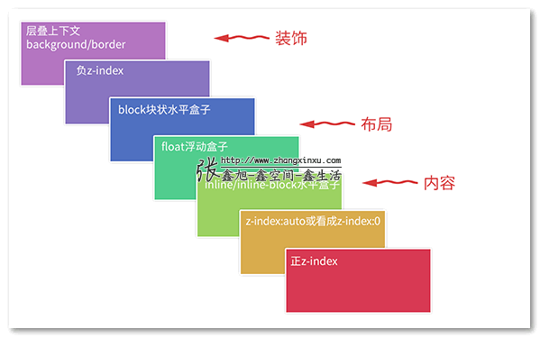

# CSS 效果

## 输入框光标颜色的设置

```css
.input {
  color: black;
  caret-color: red; 
  /*插入光标颜色，小程序真机表现无效，大概率是因为input在focus状态下表现为原生组件，样式对原生组件内部无效*/
}
```

## 文字一半区域色块效果实现

```css
// recommand
span {
  text-decoration: underline #f005 .5em;
  text-underline-offset: -4px;
}
// or
span { box-shadow: inset 0 -0.6em 0 0 rgba(219, 42, 42, 0.5); }
// or
span { background: linear-gradient(rgba(255,0,0,.5),rgba(255,0,0,.5)) 0 bottom/100% .5em no-repeat; }
```

其中，下划线方法是最好的，为什么呢？因为下面两种方法都要求 span 元素必须是inline水平，如果设置为 display:block 或者display: inline-block ，则就会失效。而下划线方法不受元素的display计算值影响。


## 可编辑元素有某个元素不可编辑

```css
.at {
   -webkit-user-modify: read-only;
}
```

## 定制特定字符的字体大小


```css
<span class="price">100元</span>
请补全下面CSS语句中缺少的CSS属性，实现配图所示的效果（“元”的字号小了50%）。
@font-face {
    font-family: smallYuan;
    src: local('PingFang SC'),
       local("Microsoft Yahei");
    ______size-adjust______: 50%;
    unicode-range: U+5143;
}
.price {
    font-family: smallYuan;
    font-size: 24px;
    color: red;
}
```

## 背景色消失之谜


```html
已知如下HTML和CSS代码：

<p class="caption">毛发素材</p>
img {
  display: block;
}
.caption {
  width: 200px;
  text-align: center;
  background-color: rgba(0,0,0,.5);
  color: white;
  text-shadow: 1px 1px #0003;
  line-height: 2;
  margin: -2em 0 0;
  position: relative; // 添加此行
}
渲染效果如配图所示，请问，为何<p>元素的背景色消失了？如何让背景色显示？
```



## 四角凹陷边框实现

<iframe height="300" style="width: 100%;" scrolling="no" title="四角凹陷边框实现" src="https://codepen.io/hjoker/embed/vYQOvbe?default-tab=css%2Cresult" frameborder="no" loading="lazy" allowtransparency="true" allowfullscreen="true">
  See the Pen <a href="https://codepen.io/hjoker/pen/vYQOvbe">
  四角凹陷边框实现</a> by hjoker (<a href="https://codepen.io/hjoker">@hjoker</a>)
  on <a href="https://codepen.io">CodePen</a>.
</iframe>

## 短横线按钮的实现

```css
button {
    width: 100%;
    height: 48px;
    background: linear-gradient(#000, #000) no-repeat center / 64px 2px;
}
```

## Web Animations API与淡出

```text
已知页面上有个   元素，其变量名称是  eleImage。
请使用 Web Animations API 实现点击该  元素，元素执行淡出效果并保持透明度为 0，动画时间 300ms。
```

```js
eleImage.addEventListener('click', function () {
    this.animate([
        { opacity: 1 },
        { opacity: 0 }
    ], {
        duration: 300,
        // 或者 'both'
        fill: 'forwards'
    });
});
// 或者下面语法：
eleImage.addEventListener('click', function () {
    this.animate({
        opacity: [1, 0]
    }, {
        duration: 300,
        fill: 'forwards'
    });
});
// 或者下面语法：
var animation = new Animation([effect][, timeline]);
let keyframes = new KeyframeEffect(eleImage, [
  { opacity: 1},
  { opacity: 0}
], {
  duration: 300,
  fill: 'forwards'
});
let animation = new Animation(keyframes);
// 点击元素
eleImage.addEventListener('click', function() {
  animation.play()
});
```

## 带分割线的按钮组

<iframe height="300" style="width: 100%;" scrolling="no" title="带分割线的按钮组" src="https://codepen.io/hjoker/embed/yLQNweb?default-tab=css%2Cresult" frameborder="no" loading="lazy" allowtransparency="true" allowfullscreen="true">
  See the Pen <a href="https://codepen.io/hjoker/pen/yLQNweb">
  带分割线的按钮组</a> by hjoker (<a href="https://codepen.io/hjoker">@hjoker</a>)
  on <a href="https://codepen.io">CodePen</a>.
</iframe>

## 文字两侧中横线

<iframe height="300" style="width: 100%;" scrolling="no" title="文字两侧中横线" src="https://codepen.io/hjoker/embed/RwqPdKX?default-tab=css%2Cresult" frameborder="no" loading="lazy" allowtransparency="true" allowfullscreen="true">
  See the Pen <a href="https://codepen.io/hjoker/pen/RwqPdKX">
  文字两侧中横线</a> by hjoker (<a href="https://codepen.io/hjoker">@hjoker</a>)
  on <a href="https://codepen.io">CodePen</a>.
</iframe>

## 打印如下页面结构，H2标题均在新页的顶部

已知一个HTML文档页面的HTML结构如下：

```html
<h1>标题</h1>
<p>概述。</p>
<h2>二级标题1</h2>
<p>内容。</p>
<h2>二级标题2</h2>
<p>内容。</p>
<h2>二级标题3</h2>
<p>内容。</p>
```

请写下一段完整的CSS语句（包括CSS选择器），实现对当前页面执行打印操作的时候，所有的二级标题均是新开的打印页的顶部。例如“二级标题1”就在第2页的顶部，二级标题2”就在第3页的顶部，二级标题3”就在第4页的顶部。

```css
@media print {
  h2 {
    break-before: always;
    page-break-before: always;
  }
}
```